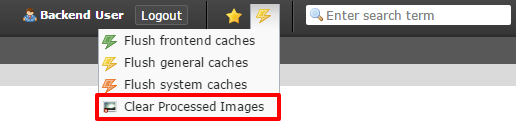

.. ==================================================
.. FOR YOUR INFORMATION
.. --------------------------------------------------
.. -*- coding: utf-8 -*- with BOM.

.. include:: ../Includes.txt

.. _introduction:

Introduction
============

.. _what-it-does:

What does it do?
----------------

The extension adds a link to the clear cache menu (flush caches) for editors and admins. On click the processed images will be
deleted like the button in the install tool would do. Afterwards the frontend cache is cleared automatically.

For editors this link is useful after the replacing of images or files in the filelist.

.. important::

   The link clears the frontend caches, too.

Just install the extension and reload the backend. The link will appear in the clear cache menu.

.. _screenshots:

Screenshots
-----------

   The clear processed images link for editors and admins.